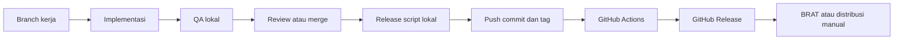

# SDLC for this plugin

Dokumen ini menjelaskan kenapa repo ini memakai alur branch, QA, dan release seperti sekarang.

## Tujuan SDLC di repo ini

MD Writer adalah plugin editor yang sensitif terhadap regresi UI, perilaku keyboard, sinkronisasi state, dan pengalaman menulis. Karena itu, SDLC-nya perlu menjaga empat hal:

- perubahan tetap fokus,
- QA lokal mudah diulang,
- metadata release tidak drift,
- dan GitHub release selalu bisa dipakai sebagai sumber distribusi.

## Gambaran alur

## Kenapa branch terpisah dipakai

Branch terpisah membantu memisahkan:

- eksperimen feature,
- bugfix yang harus cepat,
- dan perubahan release metadata.

Untuk plugin seperti ini, perubahan kecil di satu feature bisa berimbas ke scrolling, decorations, atau DOM editor. Branch kerja membuat ruang review lebih bersih dan rollback lebih aman.

## Kenapa QA lokal tetap penting

Check otomatis bisa menangkap:

- type error,
- lint issue,
- dan beberapa inkonsistensi kode.

Tetapi check otomatis tidak cukup untuk memastikan:

- scroll typewriter terasa benar,
- overlay visual tidak mengganggu editor,
- outliner focus tidak merusak konteks pengguna,
- atau writing focus tidak menyembunyikan elemen yang salah.

Karena itu QA manual di Obsidian tetap bagian inti dari alur kerja.

## Kenapa release metadata divalidasi ketat

Distribusi plugin via GitHub release bergantung pada konsistensi metadata:

- tag git,
- `package.json.version`,
- `manifest.json.version`,
- `versions.json`,
- dan `minAppVersion`.

Kalau salah satu drift, efeknya bisa berupa:

- CI membuat release yang salah,
- BRAT menarik versi yang tidak sinkron,
- atau pengguna mendapat artefak yang tidak cocok dengan metadata plugin.

Karena itu repo ini memvalidasi metadata di dua tempat:

- secara lokal saat menjalankan `pnpm run release`,
- dan di GitHub Actions saat tag dipush.

## Kenapa tag dibatasi ke `x.y.z`

Obsidian mengharapkan versi plugin dalam format `x.y.z`. Menyamakan aturan itu dengan Git tag mengurangi cabang logika yang tidak perlu:

- tidak ada konversi antara `v1.2.3` dan `1.2.3`,
- tidak ada pertanyaan apakah prerelease boleh dipakai,
- dan tidak ada perbedaan antara versi source dan versi release asset.

Tradeoff-nya jelas: repo ini memilih konsistensi release dibanding fleksibilitas format tag.

## Kenapa GitHub Actions tetap membuat release

Pemisahan antara release script lokal dan GitHub Actions memberi dua lapisan tanggung jawab:

- lokal: menyiapkan metadata source of truth dan tag,
- CI: memverifikasi lagi, build bersih, lalu mempublikasikan artefak.

Ini lebih aman daripada membuat aset release langsung dari mesin lokal karena hasil akhir dibangun ulang di environment CI yang konsisten.
